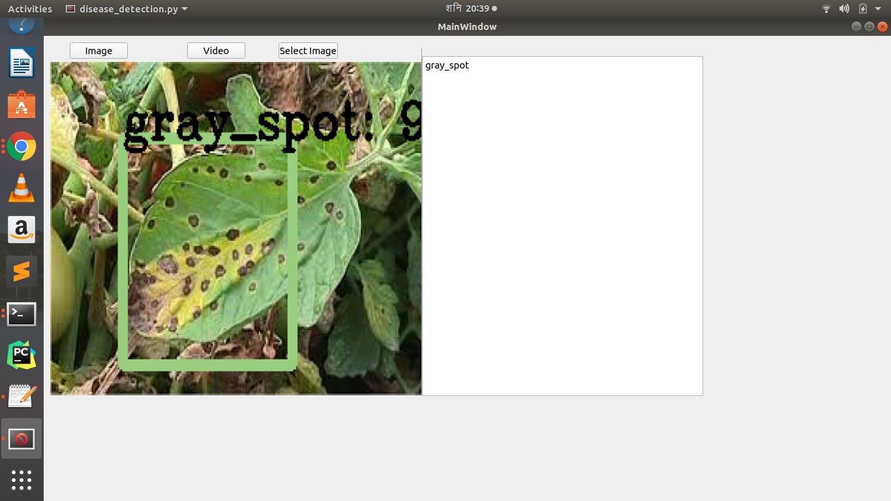

# Rapport de Projet
Thème : Conception et réalisation d’un détecteur intelligent pour les maladies des plantes.
-	Cas de la Tomate :
## Intro
La Détection des maladies de la tomate à l'aide de YOLOv2. Il s’agit d’une implémentation en python de la version darknet de yolo.
Peut détecter le mildiou, le chancre bactérien, la tache grise et une plante en bonne santé. 
1.	Le mildiou 
2.	Le chancre bactérien 
3.	La tache grise 
4.	Une plante en bonne santé. 

## Configuration de l’espace de travail
Outils utilisés : Python3, tensorflow 1.0, numpy, opencv 3, pyqt5
Pour installer ces outils, exécuter les commandes suivantes dans l’invite de commande (bien sur après avoir installé le logiciel python) :
$ pip3 install opencv-contrib-python 
$ pip3 install tensorflow 
$ pip3 install numpy 
$ pip3 install pyqt5
$ pip install Cython
Installer Microsoft Visual C++ 14.0 en utilisant le lien suivant pour télécharger : https://aka.ms/vs/16/release/VC_redist.x64.exe 

## Aperçu de l'interface

  

### Getting started

You can choose _one_ of the following three ways to get started with darkflow.

1.  git clone https://github.com/tsopnangsr/detection-des-maladies-de-la-tomate.git
2.  cd detection-des-maladies-de-la-tomate
3.  python3 setup.py build_ext --inplace
   

